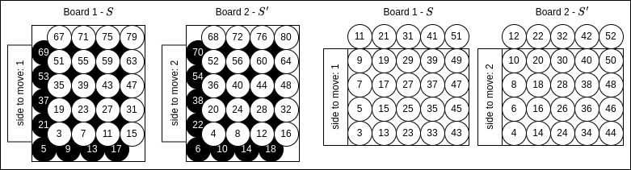

# Connect4 Strong Solver

This project is an open-source implementation of the symbolic search approaches described in
```
Edelkamp, S., & Kissmann, P. (2011, August). On the complexity of BDDs for state space search: A case study in Connect Four.
In Proceedings of the AAAI Conference on Artificial Intelligence (Vol. 25, No. 1, pp. 18-23).
```
and
```
Edelkamp, S., & Kissmann, P. (2008). Symbolic classification of general two-player games.
In KI 2008: Advances in Artificial Intelligence: 31st Annual German Conference on AI, KI 2008, Kaiserslautern, Germany, September 23-26, 2008. Proceedings 31 (pp. 185-192). Springer Berlin Heidelberg.
```
to count the number of unique positions and to produce a strong solution of a Connect4 game of a given board size, respectively.

The number of positions for the conventional 7 x 6 board can be computed in ~3h with 16 GB RAM.

The strong solution of the 7 x 6 instance takes ~47 hours and 128 GB RAM.
It is published on [Zenodo](https://zenodo.org/records/14582823).

## Overview

### Binary Decision Diagrams Library

In `src/bdd`, you can find a simple library to work with [binary decision diagrams](https://en.wikipedia.org/wiki/Binary_decision_diagram).  
It is designed to give the user great control over memory.  
The user specifies the number of all allocatable BDD nodes with the `log2_tablesize` parameter.  
For instance, `log2_tablesize=28` fits into 16 GB RAM and allows you to allocate 2^28 = 268,435,456 nodes simultaniously.  
If you increase, `log2_tablesize` by one, it doubles the required RAM and number of allocatable nodes.  
The maximum number is  `log2_tablesize=32`.

The user has to manually keep track of BDD node references and manually perform garbage collection to free and reuse nodes, see [src/bdd/uniquetable.h]().

### Queens
To demonstrate the usage of the library, we also include an implementation of the [n-queens puzzle](https://en.wikipedia.org/wiki/Eight_queens_puzzle).

Go to its directory, `cd src/queens`, and compile it with `make`.  
Run with `queens.out log2_tablesize N`, where `N` is the board size.
E.g. `queens.out 22 8` or `queens.out 27 12`.  
You may play around with trading of speed versus memory usage. E.g. `queens.out 24 12`.


### Connect4

Go to `src/connect4`.

#### Encoding
There are multiple ways to encode a Connect4 position with Boolean variables.
Edelkamp and Kissmann use `2 * width * height + 1` variables: one variable denotes the side-to-move and there are two variables per board cell indicating whether it is empty, occupied by the first player, or occupied by the second player.
For this cell-wise encoding, Edelkamp and Kissmann proved that the algorithmic complexity of counting all unique positions is exponential in `min(width, height)`, independent of variable ordering.
We have implemented their encoding for both a row-wise and column-wise order.
To encode transititoins, we need two sets of variable, i.e. two boards.
While they have not explicitly mentioned how to order the variables belonging to the same cell we take following approach: player-1-board-1, player-1-board-2, player-2-board-1, player-2-board-2, as illustrated below on the left.


Inspired by bitboard representations~\cite{tromp2008solving,Herzberg}, we have also implemented a more compressed encoding with only `width * (height + 1)`variables, illustrated above on the right.
In this encoding, each cell has only one variable.
The lowest available cell per column is always `true`.
All cells below the lowest available cell are occupied and `true` if the disc belongs to the first player else `false` (the disc belongs to the second player).
To facilitate this logic, we need an additional row.
This encoding outperforms the standard encoding for the 7 x 6 board configuration, but performs poorly if the number of rows is large.


#### Counting number of unique positions
Compile with `make count`.
Options:
- `COMPRESSED_ENCODING`: whether to use compressed encoding (default: `1`)
- `ALLOW_ROW_ORDER`: whether to sort variables by row instead of column if `heigth > width`. Is irrelevant if `height <= width` (default: `0`)
- `FULLBDD`: whether to compute BDD that represents all unique positions (= union of positions per ply, default: `0`)
- `SUBTRACT_TERM`: whether to use Connect4 termination criterion (default: `1`)
- `ENTER_TO_CONTINUE`: whether to require to press enter to start computation (default: `0`)
- `WRITE_TO_FILE`: whether to write results to `.csv` file (default: `1`)
- `IN_OP_GC`: whether to allow automatic garbage collection during BDD operations (default: `1`)
- `IN_OP_GC_THRES`: fill-level of node pool above which garbage collection is triggerd if `IN_OP_GC=1` (default: `0.9999`)
- `IN_OP_GC_EXCL`: whether to exclusively perform automatic garbage collection instead of at manually set points (default: `0`)

Run with `./build/counts.out log2_tablesize width height`.

Generally, if you have enough memory available, `log2_tablesize` should be chosen such that the maximum fill-level of the node pool does not exceed 50 %.
Otherwise, performance degrades.
If the garbage collection manually set program points is not enough, then you may encounter a `uniquetable too small` error, i.e. there are no more nodes available to allocate.
In this case you may try to set `IN_OP_GC=1`.
Then, if the fill level exceeds `IN_OP_GC_THRES` during a BDD operation, garbage collection will be triggered.
This wrecks performance, because all caches are also cleared, which are heavily used during operations.
For `IN_OP_GC=1` (and gariage collection in general) to work, the program has to be written in a way such that all BDD nodes that are used later on will be kept alive with reference counting, i.e. `keep_alive(node)`.
Lastly, setting `FULLBDD=1` increases computation and memory usage slighlty, because a union over all the BDD encoding the position at each ply is iteratively performed and kept alive.
Set only if you are intersted in the number of nodes required to encode all positions, not just the position counts.

Some examples to demonstrate flags:

- `make count COMPRESSED_ENCODING=1 FULLBDD=0 IN_OP_GC=0`
    - `./build/count.out 29 7 6`: uses <32 GB RAM, fill-level: 28.50 %, finishes in 6290.382 seconds.
    - `./build/count.out 28 7 6`: uses <16 GB RAM, fill-level: 56.99 %, finsihes in 6879.484 seconds.

- `make count COMPRESSED_ENCODING=1 FULLBDD=0 IN_OP_GC=1`
    - `./build/count.out 27 7 6`: uses <8 GB RAM, triggers IN_OP_GC 3 times, finishes in 10816.522 seconds.

- `make count COMPRESSED_ENCODING=0 FULLBDD=0 IN_OP_GC=0`
    - `./build/count.out 29 7 6` uses <32 GB RAM, fill-level: 44.43 %, finsihes in 10083.400 seconds.
    - `./build/count.out 28 7 6` uses <16 GB RAM, fill-level: 88.86 %, finishes in 11715.221 seconds.

- `make count COMPRESSED_ENCODING=1 FULLBDD=1 IN_OP_GC=0`
    - `./build/count.out 29 7 6` uses <32 GB RAM, fill-level: 48.21 %, finishes in 8021.748 seconds.

- `make count COMPRESSED_ENCODING=0 FULLBDD=1 IN_OP_GC=0`
    - `./build/count.out 29 7 6` uses <32 GB RAM, fill-level: 75.40 %, finishes in 12807.400 seconds.

- `make count COMPRESSED_ENCODING=1 FULLBDD=1 IN_OP_GC=0 SUBTRACT_TERM=0`
    - `./build/count.out 29 7 6` uses <32 GB RAM, fill-level: 0.17 %, finishes in 67.398 seconds.

If this takes too long on your computer you may try:

- `make count COMPRESSED_ENCODING=1 FULLBDD=0 IN_OP_GC=0`
    - `./build/count.out 26 6 6`: uses <4 GB RAM, fill-level: 60.02 %, finishes in in 978.566 seconds.

#### Solving Connect-4
Compile with `make solve`.
Options:
- `COMPRESSED_ENCODING`
- `ALLOW_ROW_ORDER`
- `ENTER_TO_CONTINUE`
- `WRITE_TO_FILE`
- `IN_OP_GC`
- `IN_OP_GC_THRES`
- `IN_OP_GC_EXCL`
- `SAVE_BDD_TO_DISK`: whether to save the strong solution as BDD to disk (default: `1`)

Run with `./build/solve.out log2_tablesize width height`.

If `SAVE_BDD_TO_DISK=1`, then for each ply three files will be generated. One BDD that is sat for won positions, one for drawn, and one for lost positions.
These files will be stored in the `solution_w{WIDTH}_h{HEIGHT}` folder.
For information on other options, see previous section.

Some example runs:

- `make solve COMPRESSED_ENCODING=1`
    - `./build/solve.out 29 6 6`: uses <32 GB RAM, fill-level: 51.79 %, finishes in 7659.027 seconds.
    - `./build/solve.out 24 6 4`: uses <1 GB RAM, fill-level: 12.87 %, finishes in 32.617 seconds.
    - `./build/solve.out 24 5 5`: uses <1 GB RAM, fill-level:  14.22 %, finishes in 40.008 seconds.
- `make solve COMPRESSED_ENCODING=0 IN_OP_GC=1 IN_OP_GC_THRES=0.9`
    - `./build/solve.out 29 6 6`: uses <32 GB RAM, fill-level: 90.00 %, finishes in 15383.985 seconds.
- `make solve COMPRESSED_ENCODING=1 IN_OP_GC=1 IN_OP_GC_THRES=0.9`
    - `./build/solve.out 28 6 6`: uses <16 GB RAM, fill-level: 90.00 %, finishes in 8478.253 seconds.
    - `./build/solve.out 31 7 6`: uses <128 GB RAM, fill-level: 90.00 %, finishes in 167967.311 seconds. (See results section for output and [Zenodo](https://zenodo.org/records/14582823))

#### Win-Draw-Loss Query

To query the solution generated with `solve.out` build the `wdl.out` program with `make wdl`.
Options:
- `COMPRESSED_ENCODING`
- `ALLOW_ROW_ORDER`
- `WIDTH`: the width of the Connect4 board
- `HEIGHT`: the height of the Connect4 board

The options have to be set to be compatable with the solutoin generated with `solve.out`.
Same encoding + same height and width.

Example:

`make wdl COMPRESSED_ENCODING=1 WIDTH=6 HEIGHT=6`

Output of `./build/wdl_w7_h6.out solution_w7_h6/ 332`  
    
```
input move sequence: 332
Connect4 width=7 x height=6
 . . . . . . .
 . . . . . . .
 . . . . . . .
 . . . . . . .  stones played: 3
 . . . o . . .  side to move: o
 . . x x . . .  is terminal: 0
 0 1 2 3 4 5 6

Overall evaluation = 1 (forced win)

move evaluation:
  0   1   2   3   4   5   6 
 -1   1  -1  -1   1  -1  -1 

 1 ... move leads to forced win,
 0 ... move leads to forced draw,
-1 ... move leads to forced loss
```


#### Bestmove search
To find the move that leads to the fastest win or slowest loss compile with `make bestmove`
Options:
- `COMPRESSED_ENCODING`
- `ALLOW_ROW_ORDER`
- `WIDTH`: the width of the Connect4 board
- `HEIGHT`: the height of the Connect4 board

The options have to be set to be compatable with the solutoin generated with `solve.out`.
Same encoding + same height and width.

`make wdl COMPRESSED_ENCODING=1 WIDTH=6 HEIGHT=6`

Output of `./build/bestmove_w7_h6.out solution_w7_h6/ 332`  
    
```
input move sequence: 332
Connect4 width=7 x height=6
 . . . . . . .
 . . . . . . .
 . . . . . . .
 . . . . . . .  stones played: 3
 . . . o . . .  side to move: o
 . . x x . . .  is terminal: 0
 0 1 2 3 4 5 6

Overall evaluation = 1 (forced win)

Computing distance to mate ...      
Position is 1 (win in 37 plies)
Best move is 4

n_nodes = 600314 in 0.004s (171506.525 knps)

move evaluation:

 x ... forced win in x plies,
 0 ... move leads to forced draw,
-x ... forced loss in x plies
±x ... search in progress (lower bound on final x)

  0   1   2   3   4   5   6 
 -4  37  -4  -4  37  -4  -4 
n_nodes = 5524605 in 0.022s (255009.459 knps)

best move: 1 with win in 37 plies

Connect4 width=7 x height=6
 . . . . . . .
 . . . . . . .
 . . . . . . .
 . . . . . . .  stones played: 4
 . . . o . . .  side to move: x
 . o x x . . .  is terminal: 0
 0 1 2 3 4 5 6
```

#### Generating Openingbook
The bestmove search can be sped up by creating an openingbook by evaluating all positions at a given ply (default = 8).
Compile with `make openingbook`.
Options:
- `COMPRESSED_ENCODING`
- `ALLOW_ROW_ORDER`
- `WIDTH`: the width of the Connect4 board
- `HEIGHT`: the height of the Connect4 board

The options have to be set to be compatable with the solutoin generated with `solve.out`.
Same encoding + same height and width.

Run with `generate_openingbook_w{WIDTH}_h{HEIGHT}.out folder n_workers`.  
For example `generate_openingbook_w6_h6.out solution_w6_h6/ 4` creates the openingbook with `4` threads.

It may be beneficial to do multi-processing as well.  
For this execute `python3 probe/generate_openingbook_mp.py folder width height n_workers`.  
It will spawn `n_workers / 4` processes.

The openingbook is stored as .csv where the position key (see `position_key` function in `src/connect4/probe/board.c`) is mapped to game score: `100 - ply` for win in `ply` moves and `-100 + ply` for loss in `ply` moves.
If a position is not contained in the opening book it is a draw.

#### Full Alpha-Beta Search

The bestmove search does alpha-beta pruning by leveraging the strong-solution found with `solve.out`.

For comparison, we also implemented an equivalent alpha-beta search that does not make use of the strong solution.

Compile with `make full_ab_search`.

Options:
- `WIDTH`: the width of the Connect4 board
- `HEIGHT`: the height of the Connect4 board
- `DTM`: whether search move with respect to distance to mate (fastest win, slowest loss). Otherwise, only produces a win-draw-loss evaluation.

Run with `./build/full_ab_search_w{WIDTH}_h{HEIGHT}.out moveseq`.

Examples:
- `make full_ab_search WIDTH=7 HEIGHT=6 DTM=1`
    - finds solution in 131.918 seconds and 946,511,712 nodes
- `make full_ab_search WIDTH=7 HEIGHT=6 DTM=0`
    - finds solution in 114.841 seconds and 827,622,460 nodes

## Scripts to Reproduce Paper

There is a paper in progress and we have added scripts to conveniently reproduce the results.

We ran all experiments on a AMD Ryzen 9 5950X 16-Core Processor with 128 GB RAM. 

- `python3 scripts/count_positions.py RAM max_worker` counts the number of unique positions for several width-height combinations and several encodings. Results are stored in `results/count_positions_results`. The option `RAM` is the amount of memory you want to use, should be a multiple of 2. And `max_worker` is the maximum number of parallel searches. We ran the experiment with `RAM=128` and `max_worker=32`. This takes days to complete.
- `python3 scripts/analyse_count_results.py` can be used to create summary tables of the count results.
- `python3 python3 scripts/count_w_and_wo_subtract_term.py 7 6 29` was used to compare the BDD sizes when counting the number of unique positions for the 7 x 6 board with different encodings, once with the termination criteria and once without.
- `python3 scripts/solve_position.py WIDTH HEIGHT LOG_TB_SIZE COMPRESSED_ENCODING ALLOW_ROW_ORDER` can be used to compile and run the `solve.out` program with the specified parameters. We ran `python3 scripts/solve_position.py 7 6 31 1 0` to solve the 7 x 6 board with 128 GB RAM in 47 hours.
- `python3 scripts/generate_opening_book.py WIDTH HEIGHT COMPRESSED_ENCODING ALLOW_ROW_ORDER N_WORKERS` can be used to conveniently generate an opening book for the strong solution obtained with the previous script. For the 7 x 6 case it took a little more than 5 hours with 32 workers.
- `python3 scripts/print_solve_table.py` can be used to inspect the statistics per ply of the strong solution.
- `python3 scripts/compress_solution.py` was used to compress the strong solution with `7zip` for upload at [Zenodo](https://zenodo.org/records/14582823). Here we did not include the redundant `draw` BDDs to decrease the size.
- `python3 scripts/zip_results.py results/` was used to zip the logs and data results from the experiments for upload at Zenodo.

## Results

### Unique Position Counts
We were able to independently verify the numbers computed by [John Tromp](https://tromp.github.io/c4/c4.html) and produce novel counts for boards up to size `width + height = 14`.

The computations were run on a AMD Ryzen 9 5950X 16-Core Processor with 128 GB RAM. 


|   height\width |   1 |         2 |              3 |                  4 |                 5 |                  6 |                   7 |                   8 |                   9 |                 10 |                  11 |                     12 |                      13 |
|---------------:|----:|----------:|---------------:|-------------------:|------------------:|-------------------:|--------------------:|--------------------:|--------------------:|-------------------:|--------------------:|-----------------------:|------------------------:|
|              1 |   2 |         5 |             13 |                 35 |                96 |                267 |                 750 |               2,118 |               6,010 |             17,120 |              48,930 |                140,243 |                 402,956 |
|              2 |   3 |        18 |            116 |                741 |             4,688 |             29,737 |             189,648 |           1,216,721 |           7,844,298 |         50,780,523 |         329,842,064 |          2,148,495,091 |          14,027,829,516 |
|              3 |   4 |        58 |            869 |             12,031 |           158,911 |          2,087,325 |          27,441,956 |         362,940,958 |       4,816,325,017 |     64,137,689,503 |     856,653,299,180 |     11,470,572,730,124 |     153,906,772,806,519 |
|              4 |   5 |       179 |          6,000 |            161,029 |         3,945,711 |         94,910,577 |       2,265,792,710 |      54,233,186,631 |   1,295,362,125,552 | 30,932,968,221,097 | 738,548,749,700,312 | 17,631,656,694,578,592 | 420,788,402,285,901,824 |
|              5 |   6 |       537 |         38,310 |          1,706,255 |        69,763,700 |      2,818,972,642 |     112,829,665,923 |   4,499,431,376,127 | 178,942,601,291,926 |                N/A |                 N/A |                    N/A |                     N/A |
|              6 |   7 |     1,571 |        235,781 |         15,835,683 |     1,044,334,437 |     69,173,028,785 |   4,531,985,219,092 | 290,433,534,225,566 |                 N/A |                N/A |                 N/A |                    N/A |                     N/A |
|              7 |   8 |     4,587 |      1,417,322 |        135,385,909 |    14,171,315,454 |  1,523,281,696,228 | 161,965,120,344,045 |                 N/A |                 N/A |                N/A |                 N/A |                    N/A |                     N/A |
|              8 |   9 |    13,343 |      8,424,616 |      1,104,642,469 |   182,795,971,462 | 31,936,554,362,084 |                 N/A |                 N/A |                 N/A |                N/A |                 N/A |                    N/A |                     N/A |
|              9 |  10 |    38,943 |     49,867,996 |      8,754,703,921 | 2,284,654,770,108 |                N/A |                 N/A |                 N/A |                 N/A |                N/A |                 N/A |                    N/A |                     N/A |
|             10 |  11 |   113,835 |    294,664,010 |     67,916,896,758 |               N/A |                N/A |                 N/A |                 N/A |                 N/A |                N/A |                 N/A |                    N/A |                     N/A |
|             11 |  12 |   333,745 |  1,741,288,730 |    519,325,538,608 |               N/A |                N/A |                 N/A |                 N/A |                 N/A |                N/A |                 N/A |                    N/A |                     N/A |
|             12 |  13 |   980,684 | 10,300,852,227 |  3,928,940,117,357 |               N/A |                N/A |                 N/A |                 N/A |                 N/A |                N/A |                 N/A |                    N/A |                     N/A |
|             13 |  14 | 2,888,780 | 61,028,884,959 | 29,499,214,177,403 |               N/A |                N/A |                 N/A |                 N/A |                 N/A |                N/A |                 N/A |                    N/A |                     N/A |

### Representing all 7 x 6 positions in one BDD

With the compilation option `FULLBDD=1` we computed that 95,124,612 BDD nodes are enough to encode all 7 x 6 Connect4 positions with the standard encoding.

This is a bit more than the 84,088,763 number of nodes which Edelkamp, S., & Kissmann, P. claimed in 
```
Edelkamp, S., & Kissmann, P. (2008). Symbolic classification of general two-player games.
In KI 2008: Advances in Artificial Intelligence: 31st Annual German Conference on AI, KI 2008, Kaiserslautern, Germany, September 23-26, 2008. Proceedings 31 (pp. 185-192). Springer Berlin Heidelberg.
```

With the compressed encoding it only takes 59,853,336 BDD nodes.

### 7 x 6 Solution

Here are some statistics for the strong solution of the 7 x 6 board from the perspective of the first player. If ply is odd, then terminal positions are won otherwise lost for the first player.

|   ply |    states (won) |   states (drawn) |   states (lost) |   states (total) |   states (terminal) |   nodes (won) |   nodes (drawn) |   nodes (lost) |   nodes (total) |   nodes (won+drawn+lost) |
|------:|----------------:|-----------------:|----------------:|-----------------:|--------------------:|--------------:|----------------:|---------------:|----------------:|-------------------------:|
|     0 |               1 |                0 |               0 |                1 |                   0 |            52 |               1 |              1 |               1 |                       54 |
|     1 |               1 |                2 |               4 |                7 |                   0 |            52 |              66 |             94 |              94 |                      212 |
|     2 |              27 |               12 |              10 |               49 |                   0 |           263 |             152 |            169 |             188 |                      584 |
|     3 |              35 |               58 |             145 |              238 |                   0 |           413 |             409 |            560 |             297 |                    1,382 |
|     4 |             690 |              200 |             230 |            1,120 |                   0 |         1,316 |           1,159 |          1,046 |             531 |                    3,521 |
|     5 |           1,080 |              697 |           2,486 |            4,263 |                   0 |         2,815 |           2,916 |          3,410 |             888 |                    9,141 |
|     6 |          10,889 |            1,943 |           3,590 |           16,422 |                   0 |         8,022 |           6,467 |          6,333 |           1,537 |                   20,822 |
|     7 |          17,507 |            5,944 |          31,408 |           54,859 |                 728 |        17,287 |          15,373 |         19,432 |           2,546 |                   52,092 |
|     8 |         124,624 |           14,676 |          44,975 |          184,275 |               1,892 |        44,790 |          32,494 |         37,598 |           5,081 |                  114,882 |
|     9 |         197,749 |           42,896 |         317,541 |          558,186 |              19,412 |        96,605 |          75,634 |        103,390 |           8,144 |                  275,629 |
|    10 |       1,122,696 |           97,532 |         442,395 |        1,662,623 |              44,225 |       225,472 |         151,745 |        196,692 |          15,481 |                  573,909 |
|    11 |       1,734,122 |          255,780 |       2,578,781 |        4,568,683 |             273,261 |       473,318 |         332,980 |        494,548 |          24,888 |                1,300,846 |
|    12 |       8,191,645 |          541,825 |       3,502,631 |       12,236,101 |             573,323 |     1,005,142 |         632,233 |        908,352 |          41,577 |                2,545,727 |
|    13 |      12,333,735 |        1,286,746 |      17,308,630 |       30,929,111 |           2,720,636 |     2,009,688 |       1,299,574 |      2,084,118 |          68,726 |                5,393,380 |
|    14 |      49,756,539 |        2,583,292 |      23,097,764 |       75,437,595 |           5,349,954 |     3,910,552 |       2,349,278 |      3,653,045 |         113,229 |                9,912,875 |
|    15 |      73,263,172 |        5,596,074 |      97,682,013 |      176,541,259 |          20,975,690 |     7,341,883 |       4,488,590 |      7,605,748 |         205,450 |               19,436,221 |
|    16 |     255,117,922 |       10,681,110 |     128,792,359 |      394,591,391 |          38,918,821 |    13,074,218 |       7,678,007 |     12,587,399 |         337,797 |               33,339,624 |
|    17 |     369,230,362 |       21,226,658 |     467,761,723 |      858,218,743 |         130,632,515 |    22,817,526 |      13,520,818 |     23,655,811 |         614,419 |               59,994,155 |
|    18 |   1,112,643,249 |       38,582,237 |     612,658,408 |    1,763,883,894 |         229,031,670 |    36,961,565 |      21,706,747 |     36,621,547 |         972,846 |               95,289,859 |
|    19 |   1,589,752,959 |       70,754,712 |   1,907,752,131 |    3,568,259,802 |         670,491,437 |    59,529,067 |      35,041,660 |     61,958,941 |       1,720,046 |              156,529,668 |
|    20 |   4,132,585,341 |      122,495,056 |   2,491,075,548 |    6,746,155,945 |       1,108,210,254 |    87,231,324 |      52,350,828 |     88,954,106 |       2,580,881 |              228,536,258 |
|    21 |   5,849,074,428 |      208,240,707 |   6,616,029,910 |   12,673,345,045 |       2,858,601,535 |   129,146,009 |      77,086,251 |    135,108,055 |       4,279,667 |              341,340,315 |
|    22 |  13,031,002,559 |      342,506,047 |   8,637,315,382 |   22,010,823,988 |       4,434,627,684 |   170,154,453 |     106,020,104 |    178,871,366 |       5,996,668 |              455,045,923 |
|    23 |  18,317,405,077 |      543,074,854 |  19,402,748,258 |   38,263,228,189 |      10,130,180,393 |   231,613,852 |     141,963,009 |    243,423,743 |       9,260,656 |              617,000,604 |
|    24 |  34,623,818,387 |      845,872,717 |  25,361,122,355 |   60,830,813,459 |      14,654,767,176 |   272,893,906 |     177,820,871 |    296,421,995 |      12,082,764 |              747,136,772 |
|    25 |  48,376,711,901 |    1,256,717,558 |  47,632,685,500 |   97,266,114,959 |      29,672,303,474 |   342,815,670 |     216,077,224 |    360,753,249 |      17,366,699 |              919,646,143 |
|    26 |  76,568,242,258 |    1,846,266,966 |  62,314,059,815 |  140,728,569,039 |      39,696,898,910 |   359,305,861 |     244,685,750 |    404,232,494 |      21,043,741 |            1,008,224,105 |
|    27 | 106,274,173,915 |    2,578,399,088 |  96,436,935,052 |  205,289,508,055 |      71,042,927,249 |   419,723,892 |     269,575,051 |    439,379,836 |      28,022,290 |            1,128,678,779 |
|    28 | 138,476,323,812 |    3,567,644,646 | 126,013,643,486 |  268,057,611,944 |      86,949,129,149 |   389,020,517 |     274,939,257 |    454,821,971 |      31,799,618 |            1,118,781,745 |
|    29 | 190,301,585,678 |    4,687,144,532 | 157,638,115,456 |  352,626,845,666 |     136,563,138,602 |   427,026,716 |     274,526,874 |    440,003,517 |      39,362,941 |            1,141,557,107 |
|    30 | 199,698,237,436 |    6,071,049,190 | 204,609,218,821 |  410,378,505,447 |     150,692,335,491 |   347,160,424 |     251,906,206 |    423,584,106 |      41,997,064 |            1,022,650,736 |
|    31 | 269,818,663,336 |    7,481,813,611 | 201,906,000,786 |  479,206,477,733 |     205,243,451,746 |   362,858,636 |     228,078,024 |    362,445,054 |      48,323,733 |              953,381,714 |
|    32 | 221,858,140,210 |    9,048,082,187 | 258,000,224,786 |  488,906,447,183 |     200,299,011,722 |   256,335,118 |     188,918,083 |    328,791,220 |      48,313,654 |              774,044,421 |
|    33 | 291,549,830,422 |   10,381,952,902 | 194,705,107,378 |  496,636,890,702 |     232,494,602,432 |   260,638,140 |     155,709,824 |    246,069,381 |      51,955,012 |              662,417,345 |
|    34 | 180,530,409,295 |   11,668,229,290 | 241,273,091,751 |  433,471,730,336 |     195,427,938,799 |   157,385,411 |     117,478,018 |    215,831,346 |      48,778,662 |              490,694,775 |
|    35 | 226,007,657,501 |   12,225,240,861 | 132,714,989,361 |  370,947,887,723 |     188,065,840,647 |   160,409,773 |      88,337,570 |    137,452,152 |      48,332,633 |              386,199,495 |
|    36 |  98,839,977,654 |   12,431,825,174 | 155,042,098,394 |  266,313,901,222 |     131,014,104,050 |    80,553,314 |      60,594,699 |    120,050,832 |      41,909,940 |              261,198,845 |
|    37 | 114,359,332,473 |   11,509,102,126 |  57,747,247,782 |  183,615,682,381 |     100,184,819,358 |    83,790,619 |      41,853,456 |     61,427,031 |      37,278,648 |              187,071,106 |
|    38 |  32,161,409,500 |   10,220,085,105 |  61,622,970,744 |  104,004,465,349 |      54,716,901,301 |    32,744,625 |      24,888,904 |     53,915,478 |      28,733,225 |              111,549,007 |
|    39 |  33,666,235,957 |    7,792,641,079 |  13,697,133,737 |   55,156,010,773 |      31,270,711,562 |    33,780,894 |      15,576,173 |     20,081,029 |      22,165,837 |               69,438,096 |
|    40 |   4,831,822,472 |    5,153,271,363 |  12,710,802,660 |   22,695,896,495 |      11,972,173,842 |     9,782,495 |       7,772,258 |     17,351,899 |      14,031,885 |               34,906,652 |
|    41 |   4,282,128,782 |    2,496,557,393 |   1,033,139,763 |    7,811,825,938 |       4,282,128,782 |     7,938,927 |       3,499,912 |      4,036,774 |       7,901,773 |               15,475,613 |
|    42 |               0 |      713,298,878 |     746,034,021 |    1,459,332,899 |         746,034,021 |             1 |       1,783,048 |      2,731,785 |       2,777,005 |                4,514,834 |

```
states (won)      2,317,028,267,398
states (drawn)      123,343,183,724
states (lost)     2,091,613,767,970
states (total)    4,531,985,219,092
```